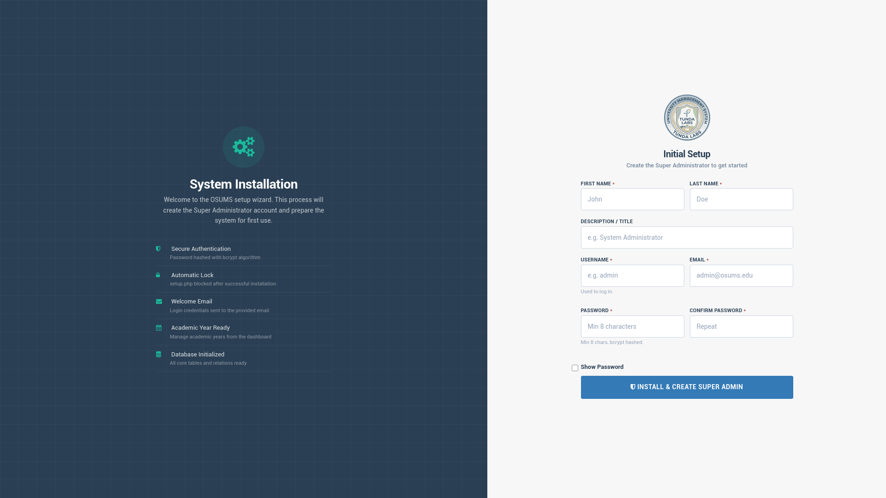
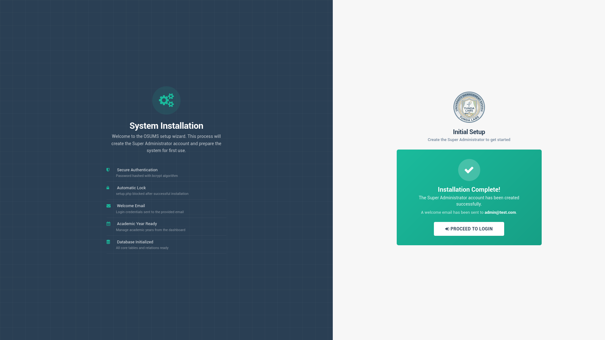
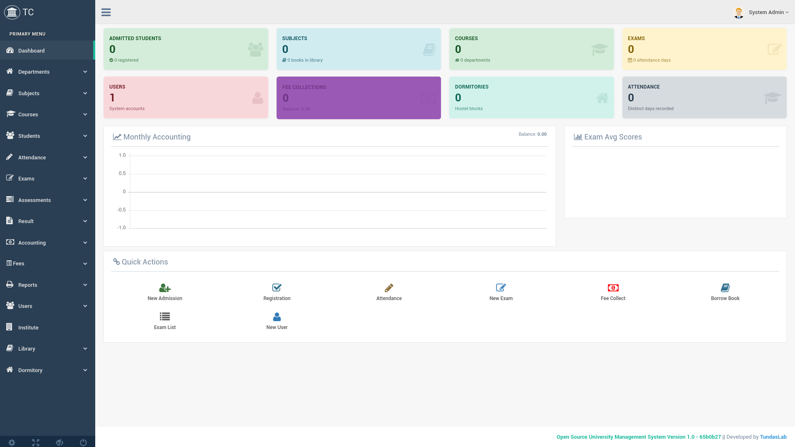
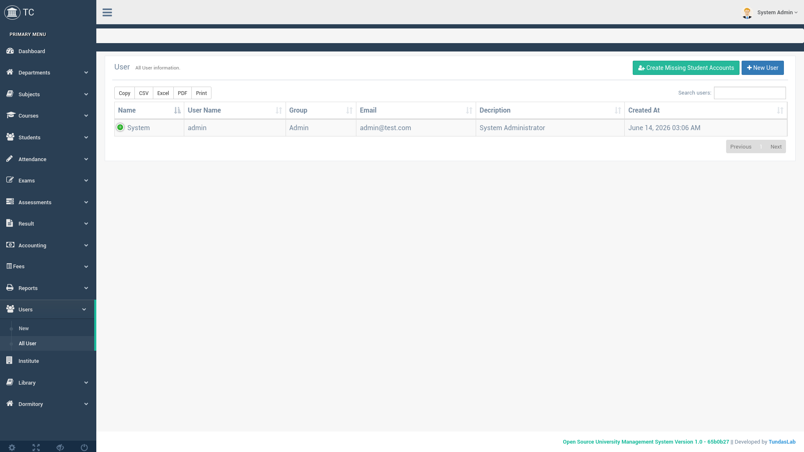

<div align="center">
  <h1>🎓 OSUMS</h1>
  <p><strong>Open Source University Management System</strong></p>
  <p>
    <a href="https://github.com/noumanTunda/University-Management-System">
      
    </a>
    <a href="https://github.com/noumanTunda/University-Management-System">
      
    </a>
    <a href="https://github.com/noumanTunda/University-Management-System">
      
    </a>
    <a href="https://github.com/noumanTunda/University-Management-System">
      
    </a>
  </p>
</div>

---

## 🚀 Quick Start

```bash
# 1. Clone the repository
git clone https://github.com/noumanTunda/University-Management-System.git
cd University-Management-System

# 2. Start Docker containers
docker compose up -d

# 3. Install dependencies
docker compose exec app composer install

# 4. Configure environment
cp .env.example .env
docker compose exec app php artisan key:generate

# 5. Run migrations
docker compose exec app php artisan migrate

# 6. Open setup wizard in browser
open http://localhost:8080/setup.php
```

---

## 🔧 Installation Wizard (First-Time Setup)

If the database is empty, visit **`http://localhost:8080/setup.php`** to launch the interactive installation wizard:

1. Enter Super Admin details (First Name, Last Name, Username, Email, Password)
2. The wizard creates the admin account and locks itself after completion
3. A welcome email is sent via MailHog (view at `http://localhost:8025`)
4. After setup, access the system at `http://localhost:8080/login`

> **Note:** `setup.php` is automatically blocked after installation via `storage/installed.lock`

---

## 🗄️ Database Backup (If Migrations Fail)

If `php artisan migrate` fails (e.g., due to PHP version incompatibility or missing `doctrine/dbal`), import the provided database backup:

```bash
# 1. Ensure the database exists
docker compose exec db mysql -u root -psecurePassword -e "CREATE DATABASE IF NOT EXISTS databaseName;"

# 2. Import the SQL dump
docker compose exec -T db mysql -u root -psecurePassword databaseName < database/db_backup.sql

# 3. Verify the import
docker compose exec db mysql -u root -psecurePassword databaseName -e "SHOW TABLES;"
```

To generate a fresh backup after modifications:
```bash
docker compose exec db mysqldump -u root -psecurePassword databaseName > database/db_backup.sql
```

---

## 📋 About

**OSUMS** is a full-featured university management system built on Laravel 5.2. It follows **Tanzania TCU grading standards**, integrates with **GePG (Government e-Payment Gateway)** for fee collections, and includes a **double-entry accounting system** with full audit trail.

### Key Features

| Module | Description |
|--------|-------------|
| **Installation Wizard** | Interactive `setup.php` — creates Super Admin, sends welcome email, auto-locks after install |
| **Student Management** | Admission, bulk CSV import, auto-user creation via `updateOrCreate`, course assignment |
| **Semester Registration** | Batch-based registration with academic year validation, "All Departments" option |
| **CA/UE Assessment** | TCU-compliant grading with user-definable components; templates merged into plans |
| **Exam Sitting Types** | Regular, Special, Supplementary, Retake — each with different grade capping rules |
| **GePG Payments** | 12-digit control numbers, partial payments, student self-service, accountant delete/edit |
| **Enterprise Accounting** | Chart of Accounts, double-entry journal, trial balance, fee invoices, payment allocations |
| **Teacher Subject Filtering** | Teachers see only their assigned subjects per academic year (pivot with `academic_year_id` FK) |
| **Student Portal** | Login with student ID, view grouped results (by year/semester), attendance, fees, library, room |
| **Academic Year CRUD** | Admin/HOD can Create, Read, Update, Delete academic years with single-active toggle |
| **Dormitory Sign In/Out** | Room assignment, sign out with key submission, sign in requests approved by Teacher/HOD |
| **RBAC** | Admin, HOD, Teacher, Accountant, Student roles with middleware gates |
| **Curriculum Builder** | Year × Semester subject matrix with credit tracking |
| **Library** | Book catalog, issue/return, borrowing history |
| **Assessment Templates** | Reusable component definitions merged into plans (`is_template` flag) |
| **Bulk CSV Upload** | Download template with enrolled students, upload marks with existing data pre-filled |
| **Breadcrumbs** | Navigation trail on major pages (Dashboard > Assessments > Mark Entry) |
| **Email** | MailHog integration for development email testing |
| **404 Handling** | Invalid URLs redirect to login page |

---

## 🐳 Docker Services

| Service | Container | Port |
|---------|-----------|------|
| **App** | PHP 7.4-FPM (Laravel 5.2) | `:8080` |
| **Database** | MySQL 8.0 / MariaDB 11.8 | `:3306` |
| **MailHog** | Email testing | SMTP `:1025`, UI `:8025` |

---

## 🖼️ Screenshots

<div align="center">

| | | |
|:---:|:---:|:---:|
|  |  |  |
| **Dashboard** | **Department Creating** | **Subject Management** |
|  |  |  |
| **Student Registration** | **Student Managementr** | **View Student Information** |
|  |  |  |
| **Register Student** | **Attendance Taking** | **Fee Allocation** |
|  |  |  |
| **Accounting** | **Student Fee Collection Report** | **Dormitory** |
|  |  |  |
| **Library** | **Book Information** | **User Account Information** |
|  |  |  |
| **Student Report** | **System Initial Setup** | **System Onboarding** |
|  |  | |
| **Dashboard** | **Student Account Creation** | |

</div>

---

## 🔑 Default Logins

| Role | Username | Password |
|------|----------|----------|
| Admin | Set via setup wizard | Set via setup wizard |
| Teacher | Teacher's login ID | Last name |
| Accountant | Accountant's login ID | Last name |
| HeadOfDepartment | HOD's login ID | Last name |
| Student | Student ID (e.g. `T21-03-12111`) | Last name (e.g. `Doe`) |

---

## 🧩 System Structure

```
app/
├── Http/
│   ├── Controllers/         # All controllers (~30+)
│   ├── Middleware/           # admin, hod, teacher, account, student middleware
│   └── routes.php            # Web routes
├── Models/                   # Eloquent models
├── Providers/                # AuthServiceProvider (gates)
├── Exceptions/               # 404 → redirect to /login
database/
├── migrations/               # ~30 migration files
└── seeds/                    # Database seeders
public/
├── setup.php                 # Installation wizard
└── assets/                   # CSS, JS, images
resources/
├── views/                    # Blade templates (Gentelella theme)
│   ├── layouts/
│   ├── student_portal/       # Student dashboard, assessments, attendance
│   ├── gepg/                 # Payment forms, allocation, accountant views
│   ├── assessment/           # Plans, components, templates
│   ├── exam_marks/           # Mark entry, bulk upload
│   ├── academic_year/        # CRUD views
│   └── ...
└── assets/                   # Compiled assets
docker-compose.yml            # Docker configuration
```

---

## 📚 Documentation

Full documentation is available in [`SUMMARY.md`](SUMMARY.md).

---

## 🤝 Contributing

1. Fork the repository
2. Create a feature branch (`git checkout -b feature/amazing-feature`)
3. Commit your changes (`git commit -m 'Add amazing feature'`)
4. Push to the branch (`git push origin feature/amazing-feature`)
5. Open a Pull Request

---

## 📄 License

Distributed under the MIT License. See `LICENSE` for more information.

---

## 📬 Contact

Project Link: [https://github.com/noumanTunda/University-Management-System](https://github.com/noumanTunda/University-Management-System)

---

<p align="center">Built with ❤️ using Laravel 5.2</p>
